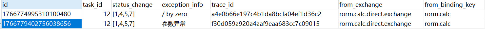

### simple-consumer & simple-provider
> 这两个模块测试了简单的使用rabbitmq发送和接收消息

simple-provider 通过单元测试向指定的队列发送消息

simple-consumer 通过@RabbitListener注解指定需要监听的队列拿到provider提供的对象

需要注入jackson2JsonMessageConverter才能让rabbitmq在传递消息时使用Jackson进行json序列化。否则默认使用Jdk对象序列化机制，并且此种情况下如果没有实现Serializable接口会导致序列化失败。
```java
@Configuration
public class MQConverterConfig {
    @Bean
    public MessageConverter jackson2JsonMessageConverter(){
        return new Jackson2JsonMessageConverter();
    }

}
```

### rorm-rmp & rorm-common & calc-engine
> rorm-rmp 消息提供者，提供计算数据，将其推送到rabbitmq  
> calc-engine 监听指定队列，对数据进行计算，模拟计算异常情况  
> rorm-common 用于定义其他两个模块的共同Maven依赖、共同实例

通过让calc-engine抛出异常的方式模拟计算异常情况。
```yaml
spring:
  rabbitmq:
    host: 192.168.194.162
    port: 5672
    username: calc_admin
    password: calc_admin
    virtual-host: /calcAdmin
    listener:
      simple:
        acknowledge-mode: auto # auto 自动（IllegalArgumentException、MessageConversionException、校验异常等会重试）  manual 手动 none 无
        retry:
          multiplier: 2 # 重试时间倍数
          enabled: true # 是否开启重试
          max-attempts: 3   # 最大重试次数
```
通过指定最大重试次数来让服务进行本地重试，防止不断地重新入队令消息队列压力增加。  
注入一个`RepublishMessageRecoverer`类型的重试策略，让**超过最大重试次数的交换机进入处理异常的消息队列**
```java
    /**
     * 注册一个策略，让消息在重试n次之后仍然失败的情况下，发给其他指定交换机
     */
    @Bean
    public MessageRecoverer messageRecoverer(RabbitTemplate rabbitTemplate){
        return new RepublishMessageRecoverer(rabbitTemplate,"rorm.calc.fail.exchange", "calc.fail");
    }
```

监听该异常队列的监听器，通过使用`@ConditionalOnProperty`注解仅在开启重试的情况下才创建交换机和队列  
通过Message作为接受类型，可以拿到更多的消息内容  
通过将日志的traceId存入数据库，可以通过该traceId在本地持久化的日志中查找到异常的产生原因且不用将堆栈信息入库


```java
@Configuration
@Slf4j
@ConditionalOnProperty(prefix = "spring.rabbitmq.listener.simple.retry", name = "enabled", havingValue = "true")
public class MQFailConfig {
    @Autowired
    private CalcFailService calcFailService;
    @RabbitListener(bindings = @QueueBinding(
            value = @Queue("rorm.calc.fail.queue"),
            key = {"calc.fail"},
            exchange = @Exchange("rorm.calc.fail.exchange")
    ))
    public void calcFailOperation(Message message){
        String traceId = UUID.randomUUID().toString().replace("-", "");
        ThreadContext.put("traceId", traceId);
        log.warn("【监测到失败的计算任务，打印异常堆栈】");
        log.warn("{}", message.getMessageProperties().getHeaders().get("x-exception-stacktrace"));
        calcFailService.saveFailMessageInfo(message, traceId);
        ThreadContext.clearMap();
    }

}
```
数据库持久化必要信息用于异常排除使用


### 附录
calc-engine模块中的CalcFailInfo实体类
```java
@Data
@TableName(autoResultMap = true)    // 解决查询结果为List的情况下数据丢失变成null的问题
public class CalcFailInfo implements Serializable {
    private String id;
    private Long taskId;
    @TableField(typeHandler = JacksonTypeHandler.class) // 解决无法序列化List类型到varchar类型的字段的问题
    private List<Integer> statusChange;
    private String exceptionInfo;
    private String traceId;
    private String fromExchange;
    private String fromBindingKey;
}
```
`typeHandler`属性解决了下面这个异常
```
Cause: java.lang.IllegalStateException: Type handler was null on parameter mapping for property 'statusChange'. It was either not specified and/or could not be found for the javaType (java.util.List) : jdbcType (null) combination.
	at org.mybatis.spring.MyBatisExceptionTranslator.translateExceptionIfPossible(MyBatisExceptionTranslator.java:92)
	at org.mybatis.spring.SqlSessionTemplate$SqlSessionInterceptor.invoke(SqlSessionTemplate.java:440)
	at com.sun.proxy.$Proxy95.selectList(Unknown Source)
	at org.mybatis.spring.SqlSessionTemplate.selectList(SqlSessionTemplate.java:223)
	at org.apache.ibatis.binding.MapperMethod.executeForMany(MapperMethod.java:147)
	at org.apache.ibatis.binding.MapperMethod.execute(MapperMethod.java:80)
	at org.apache.ibatis.binding.MapperProxy$PlainMethodInvoker.invoke(MapperProxy.java:152)
	at org.apache.ibatis.binding.MapperProxy.invoke(MapperProxy.java:85)
	at com.sun.proxy.$Proxy460.pagingQueryShareRecord(Unknown Source)
```